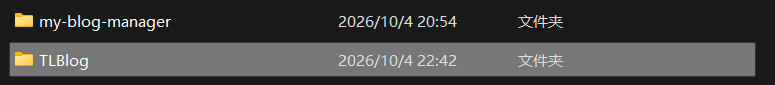
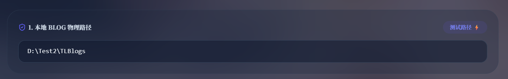
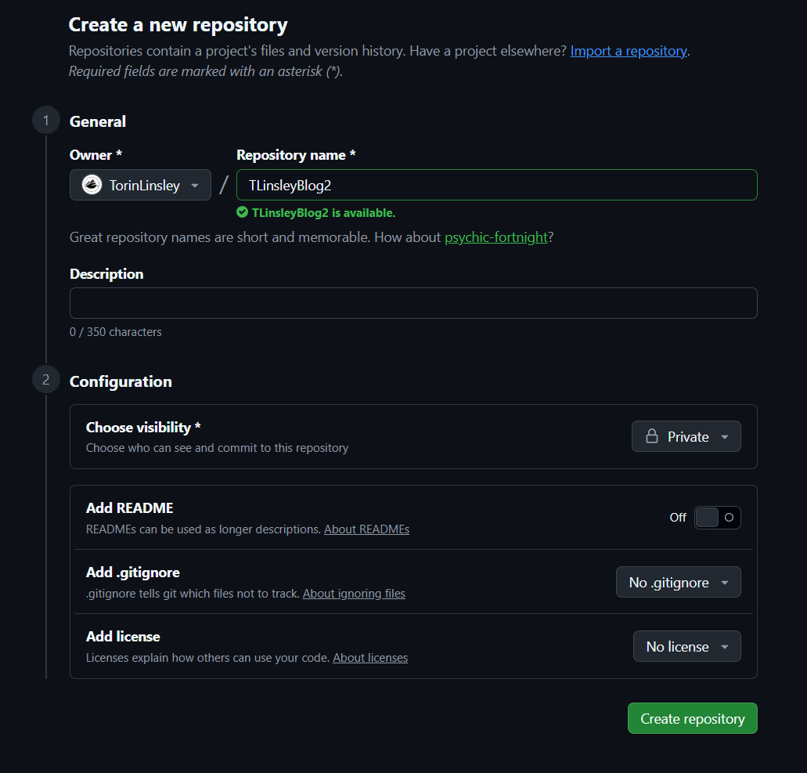

# 🌟 TLinsleyBlog

一套「**高颜值毛玻璃个人博客前台** + **网页版管理控制台**」的双项目站点，两个 Next.js 项目放在同一个目录里，
控制台负责写、改、上传、同步，前台负责展示。

- **前台** `TLBlog/` —— Next.js 16 + React 19 + Tailwind 4，文章 / 资源分享 / 工具 / 归档 / 项目 / 照片墙 / 音乐 / 灵境 / 说说 / 杂谈 / 友链 / 关于 / 评论
- **控制台** `my-blog-manager/` —— FastAPI + Next.js，**纯网页模式**（没有桌面窗口依赖），在本机跑、浏览器里操作



> 📦 这个仓库是**空模板**：文章、说说、杂谈、资源、工具、相册、友链都是空的（各目录留了 `.gitkeep` 占位），
> 外观配置保留了示例值 —— 跑起来后在控制台里换成你自己的就行 ✓
>

---

## ✨ 有什么

| 前台 | 控制台 |
|---|---|
| 毛玻璃卡片 + 动态背景（图片/呼吸渐变）+ 樱花/萤火虫/雪花/天气特效 | 富文本编辑器（Markdown 双向同步、表格、代码块高亮、折叠） |
| 文章（封面、目录、代码高亮、数学公式、callout、图片缩放、代码块折叠与一键复制） | 文章/说说/杂谈的增删改 + 草稿箱 |
| 资源分享（树形目录 + 右侧大纲 + 移动端抽屉） | 资源管理器（拖拽、重命名、回收站、批量操作） |
| 网页工具（独立 HTML 直接托管，自动注入站内导航） | 工具管理器（上传、改名、图标、深浅色主题） |
| 照片墙（相册、灯箱） | 相册/项目/友链的图形化管理 |
| 音乐（网易云歌单 + 歌词条） | 图床上传（Lsky Pro 等标准 API）+ 探针测试 |
| AI 猫猫助理（Gemini）、背景弹幕 | 站点设置（资料/显示/音乐/评论/弹幕/页脚/AI 猫） |
| 评论（GitHub 登录 + 游客昵称，同一个列表混排） | 评论管理（删除、与 GitHub Issue 双向对齐） |
| 灵境 · 创意工坊 / 帝江号 / 干员档案（等级系统可关） | 一键同步到博客前台、部署状态查看 |
| 正文里的 GitHub / Gitee 链接自动变卡片（Star/Fork 实时取） | 指纹重建脚本 + 双端配置检查（`scripts/`） |

---

## 一、环境准备

| 依赖 | 版本 | 说明 |
|---|---|---|
| Node.js | **≥ 20.9**（推荐 22） | 前台和控制台都要 |
| Python | **≥ 3.10** | 只有控制台的后端要 |
| Git | 任意 | 可选，用于版本管理 |

控制台的 Python 依赖在 `my-blog-manager/requirements.txt`，启动脚本会自动装 ✓

## 二、启动

### Windows

| 想干什么 | 双击 |
|---|---|
| 看博客前台 → http://localhost:3000 | `Start-Blog.bat` |
| 管理博客 → 浏览器自动开 http://127.0.0.1:3010 | `Start-Console.bat` |

### Linux

```bash
bash Start-Blog.sh        # 前台，默认 3000
bash Start-Console.sh     # 控制台，后端 7646 + 前端 3010

PORT=8080 bash Start-Blog.sh          # 换端口
WEB_PORT=3011 bash Start-Console.sh
```

第一次运行会自动 `npm install` / `pip install`；前台第一次会先构建一遍（1-3 分钟）。

> **入口只有这两个**（Windows / Linux 各一份，共 4 个文件）✓
>
> 前台脚本会先算一遍「代码指纹」：**只有代码、样式、`siteConfig.ts`、`data/*.ts` 变了才重新构建**；
> 改文章 / 说说 / 资源这些**内容**不用重建 —— 那些页面是请求时直接读磁盘的 ✓

## 三、第一次使用要做的两件事

**1. 填博客路径**

控制台 → 设置 → 双轨配置 → 博客路径填 `<仓库目录>/TLBlog` → **先点【测试路径】** → 通过后【保存双轨配置】

（它写进 `my-blog-manager/data/deploy_config.json`，这个文件是每台机器自己的，不会进仓库 ✓）



**2. 改站点信息**

控制台 → 设置 → 个人资料 / 站点配置：标题、头像、背景图、歌单、友链申请模板、页脚、ICP…

> ⚠️ 配置存在**两份** `siteConfig.ts` 里（`TLBlog/` 一份给前台、`my-blog-manager/` 一份给控制台），
> 控制台保存时会一起写。想确认两边有没有漏项：
>
> ```bash
> node scripts/checkConfig.mjs
> ```

## 四、内容工作流（黄金法则）

```
暂存到操作队列  →  更新本地  →  同步Blog
```

- 控制台里改完东西，先点【暂存到操作队列】（顶部工具箱会显示待办，可撤销）
- 【更新本地】= 真的写进本机文件
- 【同步Blog】= 推到前台项目（前提是博客路径配好了）

**哪些改完不用重建、哪些要重建**：

| 改了什么 | 要不要重建前台 |
|---|---|
| 文章 / 说说 / 杂谈 / 资源 / 工具 / 上传的图片 | **不用** ✓ 页面请求时读磁盘，刷新就生效 |
| 相册 / 项目 / 友链（`data/*.ts`） | **不用** ✓ 已改成运行时读盘 |
| 代码 / 样式 / `siteConfig.ts` / `package.json` | **要** —— 重跑一次 `Start-Blog`，它会自己判断并构建 ✓ |

### 内容放在哪

| 内容 | 目录 |
|---|---|
| 文章 | `posts/` |
| 说说 | `moments/` |
| 杂谈 | `chatters/` |
| 资源分享 | 前台 `TLBlog/resources/`；控制台在 `my-blog-manager/resources/ResShare/`（同步时平铺过去） |
| 网页工具 | `TLBlog/tools/`（一个工具一个目录 + `tools.json` 索引） |
| 图片 | `TLBlog/public/uploads/` |

## 五、各功能配置

### 图床

控制台 → 设置 → 图床：填 API 地址和 Token（推荐「去不图床」https://7bu.top 这类标准 API），
填完点【发送探针测试 Token】验证 ✓ 不用图床也行，直接粘贴外链图片地址 ✓

### 评论

两种发表方式，**列表是同一份、混排展示**（右上角下拉只切换发布框）：

- **GitHub 登录（Gitalk）**：需要一个**公开**仓库存留言（用 Issues，不用建分支），还要一个 OAuth App
  - GitHub → Settings → Developer settings → OAuth Apps → New OAuth App
  - `Homepage URL` 填你的博客地址，`Authorization callback URL` 填博客域名（本地调试可填 `http://localhost:3000`）
  - 拿到 `Client ID` + `Client Secret`，填进控制台 → 设置 → 评论
- **游客昵称**（不用登录）：评论存在 `data/comments/*.json`，可选镜像到对应的 GitHub Issue 留档

评论镜像用的 GitHub Token 放在 `<博客目录>/data/comments-config.json` —— 这个文件已被 `.gitignore` 排除，不会被提交 ✓

### 音乐

网易云音乐网页版打开歌曲详情页，地址栏里的数字就是歌曲 ID，粘进控制台的歌单库即可 ✓

### AI 猫猫助理

内置走 Gemini：先申请 API Key，填进控制台 → 设置 → AI 猫；线上部署时记得把 `GEMINI_API_KEY` 配到运行环境里 ✓

## 六、部署到自己的服务器

`deploy/linux/` 是一整套脚本（细节看 `deploy/linux/README.md`）：

| 脚本 | 在哪跑 | 作用 |
|---|---|---|
| `setup-server.sh` | 服务器（一次） | 装 Node 22 / nginx / systemd 服务 |
| `rebuild-if-needed.sh` | 服务器 | 按代码指纹决定要不要 `npm ci + build + 重启`；内容改动直接跳过 ✓ |
| `upload-to-server.sh` | 本机 | rsync 同步前台 + 按需重建 |
| `setup-console-server.sh` / `rebuild-console.sh` | 服务器 | 控制台后端 + 前端的服务与重建 |
| `setup-https.sh` | 服务器 | Let's Encrypt 证书 + http 301 跳 https |

Windows 上打包上传（WinSCP 拖过去就行）：

```powershell
.\deploy\windows\pack-for-server.ps1                 # 打包前台（默认输出到「下载」文件夹）
.\deploy\windows\pack-for-server.ps1 -Target console  # 打包控制台
```

双击 `deploy/windows/packForServer.cmd` 也行，它是个菜单 ✓

## 附：把源码托管到自己的 GitHub 私有仓库（可选）

想给源码留个云端备份，或者以后换电脑能直接拉下来：

1. 登录 GitHub → 右上角 **+** → **New repository**
2. **Repository name** 随便起一个（例如 `TLinsley_Blog`）；
   **Visibility 建议选 Private** —— 保护你自己的配置与内容 ✓
3. **不要**勾 `Add a README` / `Add .gitignore` / `Add license`（项目里都已经有了 ✓）
4. 建好之后，在项目根目录执行：

```bash
git init
git add -A
git commit -m "first commit"
git branch -M main
git remote add origin git@github.com:<你的用户名>/<仓库名>.git
git push -u origin main
```



> 仓库里的 `.gitignore` 已经排除了 `node_modules`、`.next`、内容目录、`data/deploy_config.json`、
> 评论用的 GitHub Token、SSH 隧道地址这些 ✓ 推上去不会带上你的密钥和本机路径 ✓
> 不放心就先 `git status` 看一眼再推 ✓
>
> 用 **SSH 地址**（`git@github.com:...`）比 HTTPS 稳得多 —— 仓库一大、网络一差，HTTPS 经常传到一半被重置 ✗

## 七、常见问题

**Q：`git push` 大仓库老是被重置（`Connection was reset`）？**
国内直连 GitHub 的 HTTPS 大传输经常被掐。改用 **SSH** 最稳：

```bash
git remote set-url origin ssh://git@github.com/<用户名>/<仓库>.git
```

（如果 bash 能用但 22 端口不通，可以在 `~/.ssh/config` 里把 `github.com` 指到 `ssh.github.com:443` ✓）

**Q：控制台改了东西，前台怎么没变？**
先确认走了完整流程：暂存 → 更新本地 → 同步Blog ✓
如果改的是**代码或 `siteConfig.ts`**，那要重跑 `Start-Blog`（它会自己判断要不要构建）✓
如果改的是配置**却怎么都不生效**，多半是改到了另一份 `siteConfig.ts` ✗ —— 跑 `node scripts/checkConfig.mjs` 检查两边 ✓

**Q：端口被占用 / 想换端口？**
`PORT=8080 bash Start-Blog.sh`、`WEB_PORT=3011 bash Start-Console.sh` ✓（Windows 改 .bat 开头那两行 ✓）

**Q：目录能改名吗？**
`TLBlog` 这个**前台目录名**别改 —— 部署脚本、控制台默认路径都按它写的。

---

## 八、更新到最新版（无损）

```bash
node scripts/update.mjs              # 更新
node scripts/update.mjs --dry-run    # 先预览：会改哪些、会合哪些、不碰哪些
```

Windows 双击 `Update.bat`、Linux 跑 `bash Update.sh` 也行 ✓

它会拉取最新代码，然后**逐个文件**判断：

| 情况 | 处理 |
|---|---|
| 内容（文章/说说/杂谈/资源/工具/图片）、站点配置、`data/*.ts`、本机配置 | **永不覆盖** ✓ |
| 你没动过的代码 | 用新版覆盖（覆盖前把旧文件备份到 `.update-backup-<时间戳>/` ✓） |
| 只有你改了、上游没动 | 保持你的版本 ✓ |
| **双方都改了** | **三方合并**：改动不冲突就自动合上（新功能 + 你的修改都在 ✓）；撞在同一处就保留你的版本，合并结果存成 `<文件名>.merge` 让你挑 ✓ |

> 三方合并靠 git；没装 git 也能用，只是「双方都改」的文件会保留你的版本、新版存成 `<文件名>.new` ✓

**维护者：你改完代码要发新版给别人时**

```bash
node scripts/update.mjs --write-manifest    # 刷新基线清单（别人靠它知道你改了哪些文件）
git add -A && git commit -m "..." && git push
```

## 写在最后

希望它能帮你省掉从零搭博客的时间：前台该有的展示都有，控制台把写文章、传图、管资源、
同步部署串成了一条流水线 —— 后面还会继续折腾 ✓

如果你觉得有用，欢迎点个 ⭐ Star ✓

## 许可证

本项目采用 **[CC BY-NC 4.0](https://creativecommons.org/licenses/by-nc/4.0/)** 许可（正文见 `LICENSE`）：
允许学习、分享、二次修改后发布，**严禁用于任何商业用途** ✓
